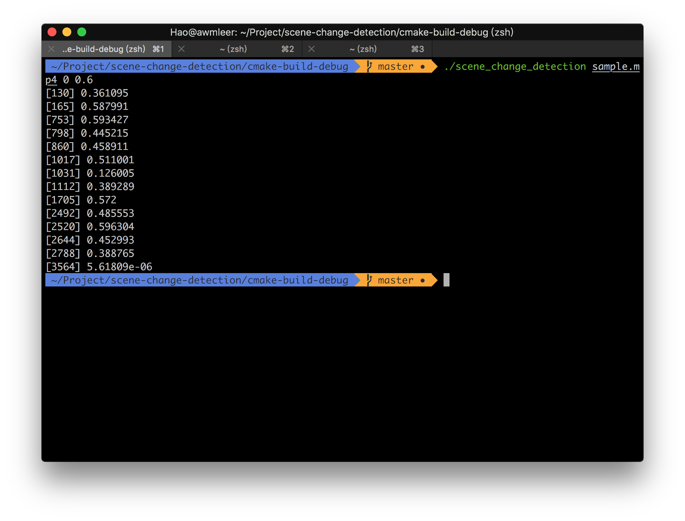
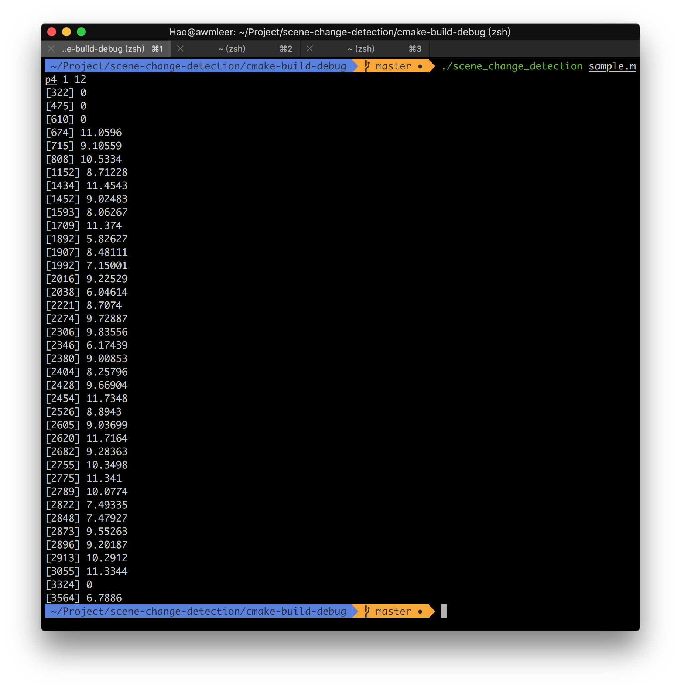

# 镜头检测实验报告

3150104785 郝广博 计算机科学与技术1502

## Project Introduction

编写程序进行视频镜头检测（2种以上算法）

输入：视频片段

输出：发生镜头切换处的帧编号

## Technical Details

### 视频、镜头、帧

动态的**视频**可以理解为是由一幅幅静态的图像构成的，这每一幅图像都称作是**帧**。

而视频往往是由一个个片段构成的，这些片段称为是**镜头**，同一组镜头中，相邻图像帧的特征保持稳定。如果相邻图像帧之间的特征发生了明显的变化，则可以认为是镜头切换了。利用这一基本的原理，可以进行镜头检测和分割的算法设计。

通过基本原理，可以发现镜头检测本质上就是要对相邻帧之间的图像**相似程度**进行判断，如果计算得到的图像相似度很低，就可以认为是镜头发生了切换。

而为了比较两张图像的相似程度，可以有很多方法，这里实现的是**直方图比较**和**PSNR方法**。

### 视频的读入

利用openCV提供的`VideoCapture`，可以很方便的读取到视频文件并自动解析，逐帧获取到图像。

```c++
VideoCapture capture = VideoCapture(videoPath);
capture >> frameA;
```

### 直方图比较

**直方图比较**是一种相对简易的算法，其思路是：

1. 把两帧图像转换为HSV色彩空间。
2. 计算两帧图像的直方图。
3. 把直方图归一化。
4. 利用openCV提供的`compareHist()`函数计算两个直方图的相似度。

核心代码如下：

```c++
//convert to HSV
cvtColor( i1, hsv1, COLOR_BGR2HSV );
cvtColor( i2, hsv2, COLOR_BGR2HSV );
//calculate histograms
calcHist( &hsv1, 1, channels, Mat(), hist1, 2, histSize, ranges, true, false );
calcHist( &hsv2, 1, channels, Mat(), hist2, 2, histSize, ranges, true, false );
//normalize
normalize( hist1, hist1, 0, 1, NORM_MINMAX, -1, Mat() );
normalize( hist2, hist2, 0, 1, NORM_MINMAX, -1, Mat() );
//compare
return compareHist(hist1, hist2, 0);
```

### PSNR

**PSNR**的全称为**峰值信噪比**（Peak signal-to-noise ratio）。其计算方法为：

1. 计算图像的MSE（均方差）：

   

   MSE其实即为两幅图像对应位置像素点的差值的平方再求平均值。

   在OpenCV中，可以利用`absdiff()`函数对两幅图像求差，利用`mul()`方法对每个像素做平方，利用`sum()`函数对所有像素求和。

2. 求PSNR：

   

PSNR越大，表示两幅图像的相似程度越高。

### 图像比较结果的筛选

通过以上两种方法，可以计算出图像的相似程度，但是还需要做进一步的筛选，得到最终镜头切换的检测结果。这里一方面要通过阈值`thresh`参数做判断，另一方面，为了防止连续几帧都被识别出来（这在一些渐变切换或者动画切换的过场中经常发生），我加入了`cooling`变量，会在连续10帧都不被识别后，才进入有效状态，允许再次检测出结果。

## Experiment Results

1. 通过`cmake`进行编译。

2. 直方图方法得到的结果：（阈值设置为0.6）

   

3. PSNR方法得到的结果：（阈值设置为12）

   

## References

> 1. https://docs.opencv.org/2.4/doc/tutorials/imgproc/histograms/histogram_comparison/histogram_comparison.html
> 2. https://en.wikipedia.org/wiki/Peak_signal-to-noise_ratio

